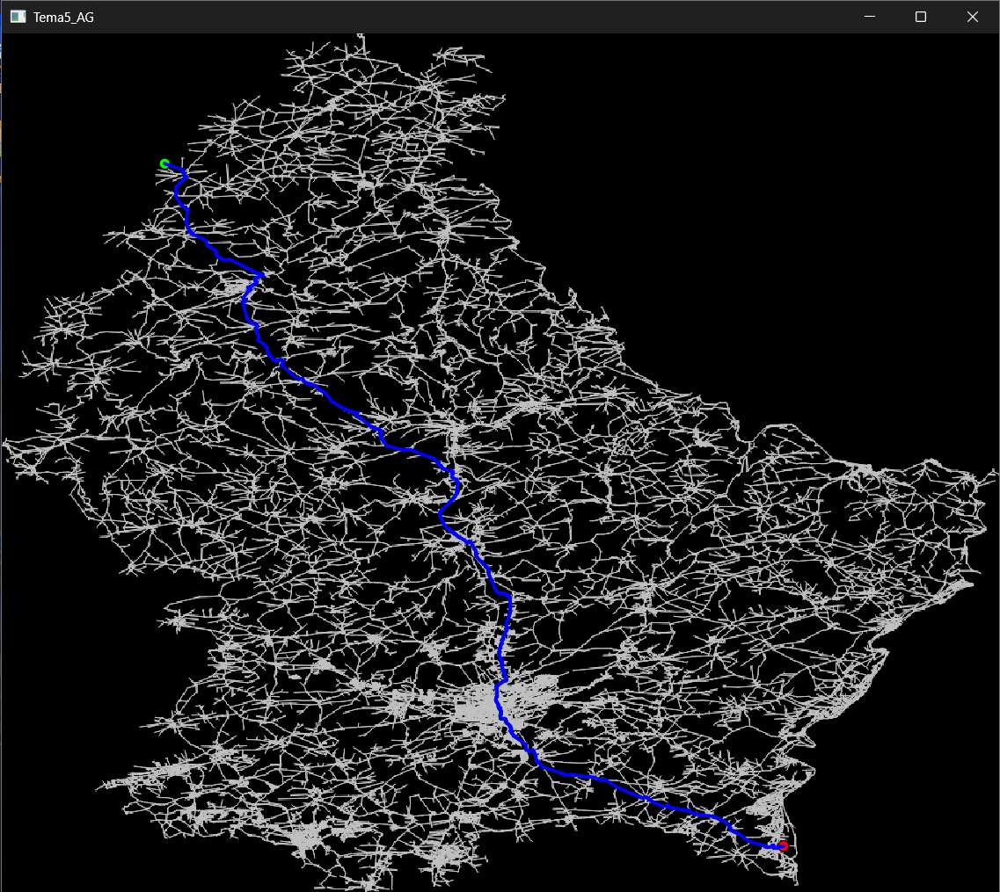

# Luxembourg Graph Navigator

A high-performance C++/Qt application designed to visualize graphs and calculate the shortest path between two points on a map of Luxembourg. 

## Overview
This project implements the **Dijkstra algorithm** to find the most efficient route in a graph network. It utilizes a **KD-Tree** for efficient spatial searching (finding the closest nodes to specific map coordinates) and features an optimized rendering engine that uses **QPixmap caching** for smooth performance, even with large datasets.

## Key Features
- **Fast Pathfinding:** Implements Dijkstra's algorithm optimized with `std::unordered_map` and `std::priority_queue`.
- **Spatial Searching:** Includes a custom KD-Tree implementation to quickly locate map nodes.
- **Optimized GUI:** Uses Qt framework with a cached rendering approach, ensuring smooth interface interaction and instant map visualization.
- **XML Integration:** Capable of loading graph data (nodes and arcs) directly from XML files.

## Technical Stack
- **Language:** C++
- **Framework:** Qt (Core, Gui, Widgets)
- **Algorithms:** Dijkstra's Algorithm, KD-Tree
- **Data structures:** `std::unordered_map`, `std::vector`, `std::priority_queue`

## Performance Optimization
The application uses **QPixmap caching** for the static map background. By drawing all the arcs onto a buffer image only when necessary (startup or window resize), the main rendering loop remains extremely fast, allowing for real-time interaction.

## Screenshots

